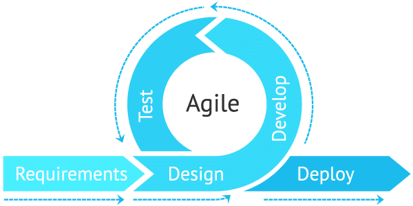

## Overview
Many volunteers often want to help more in their communities but can't find suitable opportunities or struggle with receiving responses after applying. This semester, I was fortunate to be part of a project aimed at addressing these issues. Our team developed a web application, Voluntree, designed to facilitate the process of finding and engaging in volunteer opportunities. This project enhanced my technical skills and also offered valuable insights into team collaboration and project management.

## My Contributions

As part of the Voluntree project team, I mainly contributed to the front-end development. My responsibilities included:
-Design and functionality of the Volunteer Opportunities Page: I was tasked with creating a user-friendly interface that allows volunteers to easily browse and apply for opportunities.
-UI for Adding Nonprofit Organizations: I developed the interface that enables nonprofit organizations to join the platform and post their volunteer needs.
-Footer Design: I crafted a responsive and informative footer for the website, enhancing the overall aesthetic and usability.
-Test Integration: I implemented various tests to ensure that new features functioned correctly and did not break existing functionality.

These contributions were crucial in making Voluntree a platform that meets the needs of both volunteers and organizations.

## Main Takeaways
The project solidified several important skills, notably in team collaboration and project management. Despite challenges such as misaligned schedules and the absence of two team members, we managed to maintain progress and meet our objectives. It was also a struggle getting each member to review our files each week…
This experience taught me the significance of flexibility and open communication in overcoming obstacles and ensuring project continuity.  Working on this project also allowed me to enhance my technical expertise, especially in JavaScript. For instance, I got to learn how to integrate a pie chart linked to dynamic data. This not only strengthened my programming skills but also deepened my understanding of data visualization techniques.

## Chapter 3: Issue Driven Project Management 
Lastly, another crucial concept for being a successful software engineer is a style of Agile Project Management called Issue Driven Project Management. Agile project management is an iterative approach to managing software development projects like websites. For instance, when developing a new website, a team can gather requirements, write a website brief, design, develop the site and complete testing within a single iteration. An Issue-Driven Project Management (IDPM) is a project management approach that revolves around identifying and addressing issues or tasks that need attention throughout the project lifecycle. Our team used Github to track our issues and follow the IDPM approach. As a result, we were able to efficiently split our workload between team members and track each member’s issue status. This method made us much more productive, which is why I plan to continue using it for future projects. For instance, for game development, issues can cover tasks related to gameplay mechanics, graphics, bug fixes, and performance optimization.

## Conclusion
Reflecting on my experience in ICS 414, I am immensely proud of what we achieved with Voluntree. This project was not just about developing a web application; it was about creating a tool that could genuinely make a difference in the community. The technical skills and teamwork strategies I've developed will undoubtedly serve me well in my future endeavors in the field of information and computer sciences.
