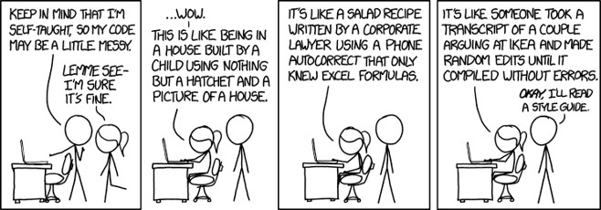
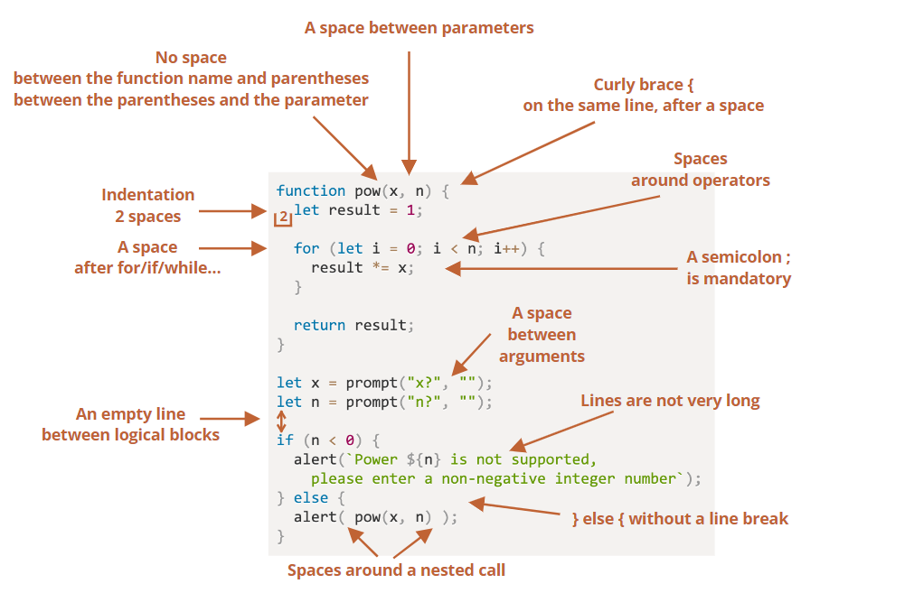

## A Lesson Learned

On many occasions, I find myself stuck on a coding project for hours. There are even times when I need to work on it for up to two to three days, all because of compilation errors. In the midst of this frustrating ordeal, I go through my messy code several times, run it repeatedly, only to find out that the cause of my error is a missing closing parenthesis. The extensive time wasted on such issues could have easily been avoided had I followed a coding standard. While seemingly minor, these standards play a crucial role in producing cleaner and more efficient code. They not only enhance code readability but also simplify the process of identifying and fixing bugs.

## A Tale of Varied Styles

Most of the computer science courses that I took had their own style guide that we had to adhere to. For example, in ICS 212, curly brackets needed to have a line of their own, and instead of using the tab key to indent, we had to add four spaces. Meanwhile, in another course, there were stricter rules regarding variable naming, spacing, and even comments. It was frustrating how style guides are not set in stone, and they vary from one course to another and even within organizations. However, when I first started using ESLint, my first impression of it was that it’s like a grammar checker specially made for software engineers. It's simple and efficient, providing us with user-friendly icons like the X mark. Despite the fact that it throws warnings for simple things like spacing, I like how hovering over the red squiggly lines under a code immediately tells me the errors or how to improve the line. It felt like a reliable autocorrect, and there was a sense of satisfaction from seeing the green checkmark, assuring me that my code will at least run.

  

The image above is a sample of syntax rules I had to follow when I worked on a team project in class. From proper indentation to consistent spacing, there were several critical aspects to be vigilant about. It's during moments like these that the true value of a reliable code analysis tool becomes evident as it saves valuable time.

## Conclusion

Overall, coding standards will differ from place to place, whether you're working in a team or individually. However, it's important to conform to a style guide because it saves time when looking for bugs and removes unneeded guesswork. So, the next time I'm stuck on a project, I have a reliable ally in the form of code analysis tools like ESLint. These tools not only uphold coding standards but also provide real-time feedback, making problem-solving a smoother and more efficient process. Embracing coding standards isn't just a good practice; it's a key to unlocking a world of cleaner, more efficient, and less error-prone code.
