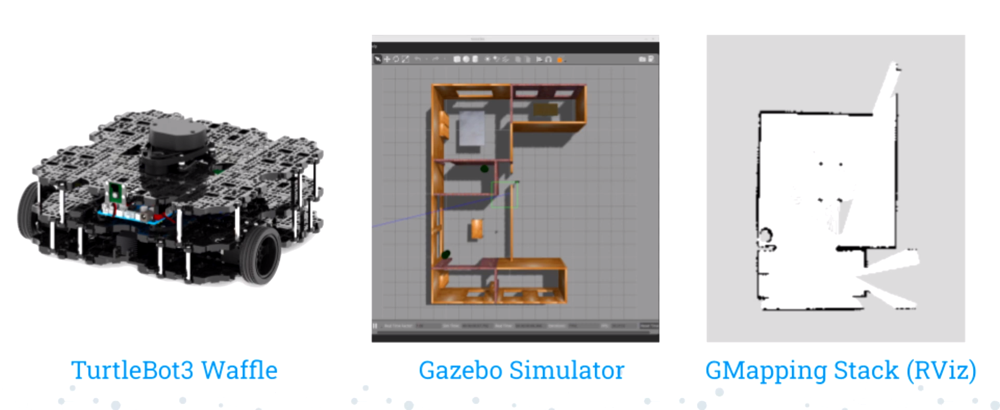

## Overview 
Autonomous vehicles and robots are increasingly visible in magazines and news stories. It seems inevitable that they will soon be a major commercial technology. The objective of this project is to use the open-source ROS mapping and navigation stack and devise a way for a mobile robot to quickly and automatically learn the physical map for a house so that it is prepared to carry out domestic activities.

## Contributions & Takeaways
In this project I gained a basic understanding of robot programming and learned about [ROS](https://www.ros.org), one of the principal tools for programming robots. I researched algorithms for mapping and robot navigation and implemented it into our code. I also learned to collaborate with a diverse group of individuals. Each team member had a different working style, so it was important to respect our differences and be willing to adapt to each other's style when appropriate.

After testing and evaluating our team's robot behavior, we successfully managed to make the auto robot wander about 1.6 rooms and trace 2.75 rooms in the span of 5 minutes. As a result, our team won first place for our Autonomous Robotics Exploration presentation:
<a href="https://youtu.be/hUV1NlEgusM?si=tpermRQr-GDt5qSC">Autonomous Robot Exploration Presentation Link</a>

  

