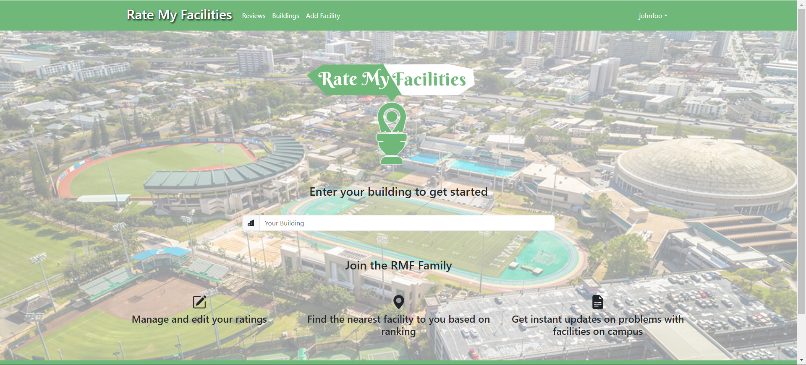
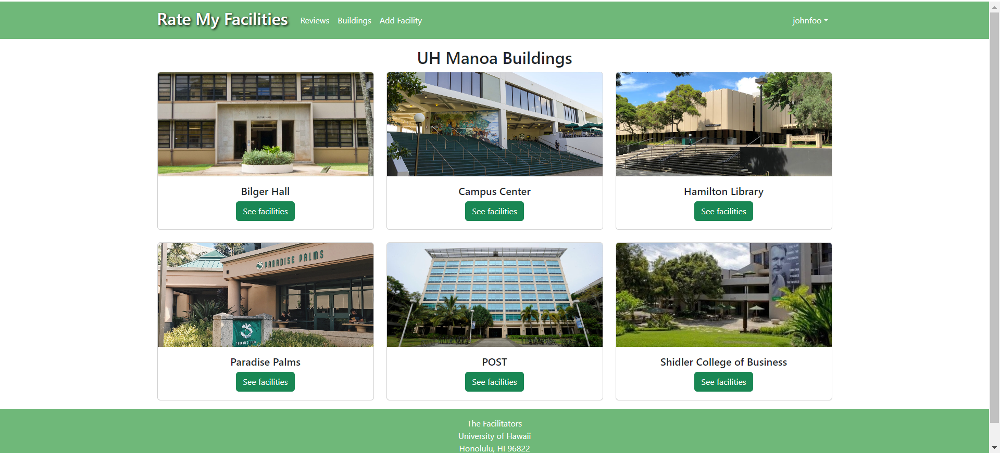

  

## Overview

Many people on campus struggle with finding facilities they are satisfied with. Well-known restrooms tend to become crowded and will sometimes run out of resources like toilet paper and soap. Water fountain filters are sometimes left unchanged for too long and will become contaminated. Popular study spaces can also become overcrowded and loud, while many “secret” spots are not utilized. Our project, Rate My Facilities, will be a resource that students can use to find facilities near them, rate their quality, and post comments about them.

## My Contributions

My role was to design the logo for our site and draft both the Buildings and Add Facility pages. The Buildings page provides a list of UH Manoa buildings with information on how many facilities they have, such as number of restrooms and water filters. After our first milestone, which was to mainly create mockup pages, I implemented the Add Facility page so that logged users can add a new facility by specifying the type of facility, the building where the facility is found, the floor number, and photos of the facility. Once they submit the information, it gets stored in our database. Other contributions include creating and using a testing framework, called TestCafe, to test for the Add Review page and also constantly updating our Github homepage for each milestone. 

  
  

## Main Takeaways

An important concept I got to learn from this project is a style of Agile Project Management called Issue Driven Project Management. My team meticulously divided tasks and utilized the Github Project board to track and manage issues. This approach made us much more productive and created less confusion on individual responsibilities. 

This project also strengthened my knowledge on Javascript. Not only did I gain more experience creating form validations but I also got to learn how to fetch and manipulate data from our collections, which solidified my understanding of Javascript.

* Source code can be found in our [Organization GitHub Page](https://github.com/d-facilitators).

* More information can be found in our [Homepage](https://d-facilitators.github.io/).
