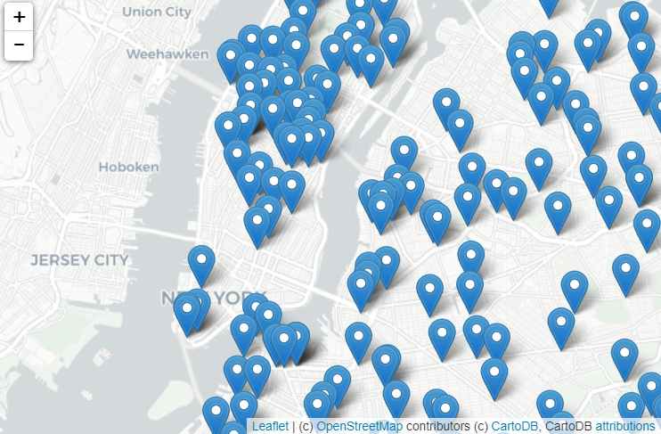
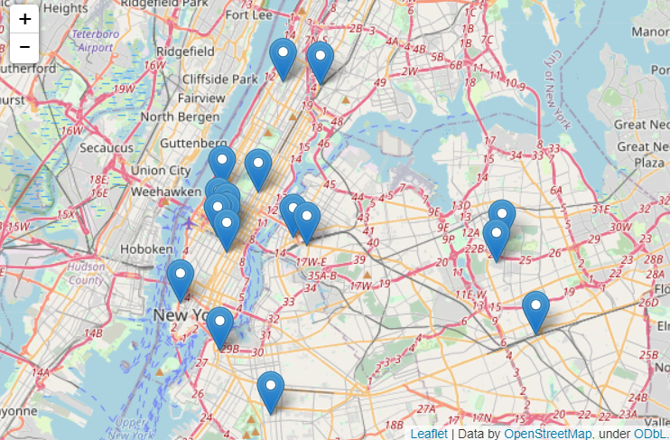

 ## Overview
Introducing Traffic Map, your trusted ally in bypassing traffic congestion and reaching your destination with ease. Often times, local drivers or daily commuters who don't use GPS navigators get stuck in traffic because they were not aware of it. Traffic Map is a program that helps users plan their routes strategically, steer clear of traffic-prone areas, and enjoy smoother journeys. 

## Takeaways
Traffic Map works by asking the user for the name of a CSV file, which contains collision data collected and made publicly by a state, such as New York City Open Data. It then asks for the name of the output file and creates a map with markers for all the traffic collisions from the input file. I worked on this individually as part of a CS class assignment and got to learn how to write programs that map GIS data using Turtles and Folium packages.

<div class="text-center p-4">
  
  
</div>

Here is a sample of my code:

```cpp
import folium
import pandas as pd

cuny = pd.read_csv('cunyLocations.csv')
print(cuny["Campus"])

mapCUNY = folium.Map(location=[40.768731, -73.964915])
for index,row in cuny.iterrows():
    lat = row["Latitude"]
    lon = row["Longitude"]
    name = row["Campus"]
    newMarker = folium.Marker([lat, lon], popup=name)
    newMarker.add_to(mapCUNY)
mapCUNY.save(outfile='cunyLocations.html')
```

